# Token Tracker V0.2 (Jupiter Edition)

A Node.js bot that discovers newly graduated Pump.fun tokens on Solana, backfills historical OHLCV data, tracks live prices via Jupiter API v3, and fires Telegram alerts when strategy conditions are met.

---

## 🚀 Features

- **Discovery**: Automatically finds new tokens migrated to Raydium via Moralis (multi-launchpad ready).
- **Live Tracking**: Polls **Jupiter Price API v3** every 15s for up to ~450 tokens (Free Tier safe).
- **Strategy**: EMA(9/20) Crossover + RSI(14) > 50 + minimum $5,000 market cap filter.
- **Alerts**: Telegram notifications with market cap, token age, MC delta (last + first alert), and clickable links to Jupiter / Axiom / DexScreener.
- **Backfill**: Fetches up to 300 1-min candles from GeckoTerminal to warm up indicators immediately.
- **Gap Fill**: On restart, patches missing candles in the background while Jupiter starts immediately.
- **Persistence**: Alert history (last MC, first MC, timestamps) stored in MongoDB — MC deltas survive restarts.
- **Auto-Pruning**: Tokens below $2K market cap or $100 5-min volume are automatically removed from tracking.
- **Resilience**: Smart queue system with retries for GeckoTerminal rate limits.
- **Hourly Reports**: Sends a "Top 5 Gainers (Last 6h)" summary to Telegram every 60 minutes.

---

## 📊 Program Algorithm

```mermaid
flowchart TD
    Start([Start Bot]) --> ConnectDB[Connect to MongoDB]
    ConnectDB --> Restore[Restore Tracked Tokens + Alert History]
    Restore --> GapFill[Gap Fill in Background]
    Restore --> StartJupiter[Start Jupiter Polling Loop]
    Restore --> StartDiscovery[Start Discovery Loop]

    subgraph Discovery_Loop ["Discovery Loop (Every 40s)"]
        D_Fetch[Fetch Moralis Tokens] --> D_Filter{New?}
        D_Filter -- No --> D_Wait[Wait]
        D_Wait --> D_Fetch
        D_Filter -- Yes --> D_MC{MC ≥ $2K?}
        D_MC -- No --> D_Skip[Skip Token]
        D_MC -- Yes --> D_Pool[Resolve Pool w/ Gecko]
        D_Pool --> D_Backfill[Backfill OHLCV to DB]
        D_Backfill --> D_Track[Add to Tracking List]
    end

    subgraph Jupiter_Loop ["Jupiter Polling Loop (Every 15s)"]
        J_Wait[Wait 15s] --> J_Fetch[Fetch Prices v3]
        J_Fetch --> J_Parse{Valid Price?}
        J_Parse -- Yes --> J_Feed[Feed CandleManager]
        J_Parse -- No --> J_Wait
    end

    subgraph Candle_Logic ["Candle Manager"]
        C_Feed[Receive Trade] --> C_Buffer[Update Buffer]
        C_Clock[15s Timer] --> C_Close[Close Candle]
        C_Close --> C_Emit[Emit 'candle' Event]
    end

    subgraph Strategy_Engine ["Strategy Engine"]
        S_Receive[Receive Candle] --> S_MC{MC ≥ $2K?}
        S_MC -- No --> S_Prune[Remove from Tracking]
        S_MC -- Yes --> S_Load[Load History 60 candles]
        S_Load --> S_Calc[Calculate EMA9, EMA20, RSI14]
        S_Calc --> S_Check{EMA Crossover AND RSI > 50 AND MC > $5k?}
        S_Check -- Yes --> S_Alert[Send Telegram Alert]
        S_Check -- No --> S_Done[End]
    end

    subgraph Volume_Prune ["Volume Prune (Every 5 min)"]
        V_Fetch[Fetch 5m Volume from DexScreener] --> V_Check{Vol ≥ $100?}
        V_Check -- No --> V_Remove[Remove from Tracking]
        V_Check -- Yes --> V_Keep[Keep Tracking]
    end

    D_Track --> J_Fetch
    J_Feed --> C_Feed
    C_Emit --> S_Receive
```



---

## 🛠 Prerequisites

- **Node.js** v18+
- **MongoDB** running locally (`mongodb://localhost:27017`)
- **API Keys**:
  - Moralis (for token discovery)
  - Jupiter (for live prices — Free tier works)
  - Telegram Bot Token & Chat ID

---

## ⚙️ Setup

### 1. Install dependencies
```bash
npm install
```

### 2. Configure `.env`
```env
MORALIS_API_KEY=your_moralis_key
JUPITER_API_KEY=your_jupiter_key
TELEGRAM_BOT_TOKEN=your_bot_token
TELEGRAM_CHAT_ID=your_chat_id
MONGODB_URI=mongodb://localhost:27017/token_tracker_v2
```

### 3. Start the bot
```bash
node index.js
```

---

## 🤖 Telegram Commands

| Command | Description |
|---|---|
| `/status` | Tracked token count, queue status, volume filter state. |
| `/api` | Health/latency of Jupiter and Moralis feeds. |
| `/tokenlist` | List all currently tracked tokens. |
| `/backfill` | Manually trigger a backfill drain (up to 10 items). |
| `/help` | Show help message. |

---

## 📬 Alert Format

```
🚨 EMA RSI Alert
──────────────────
📌 Ticker: SYMBOL
⏱ Age: 2h 14m
💰 Mkt Cap: $23.8K
📈 MC Δ last:  +18.1% (12m ago)      ← since previous alert
📈 MC Δ first: +312.4% (3.5h ago)    ← since first-ever alert
📈 RSI: 62.45
📐 EMA 9:  2.3812e-5
📐 EMA 20: 2.1044e-5
🔗 Jupiter · Axiom · DexScreener
`<mint address>`
```

---

## 🗑️ Auto-Pruning

Tokens are automatically removed from tracking when:

| Condition | Where | Trigger |
|---|---|---|
| Market cap < **$2,000** | Discovery & candle handler | On discovery (DexScreener check) and on every candle close |
| 5-min volume < **$100** | Volume prune loop | Every 5 minutes via DexScreener batch check |

Pruned tokens are marked `isActive: false` in MongoDB. Alert history is retained for reference.

---

## 📂 Project Structure

```
token tracker V0.2/
├── index.js                  # Main entry point & orchestration
├── services/
│   ├── moralis.js            # Token discovery (40s poll, multi-launchpad)
│   ├── gecko.js              # Pool resolution & OHLCV backfill
│   ├── jupiter.js            # Live Price API v3 (15s poll)
│   ├── dexscreener.js        # 5m volume & market cap lookups
│   ├── candleManager.js      # 15s candle aggregation
│   ├── strategy.js           # EMA 9/20 crossover + RSI 14
│   ├── storage.js            # MongoDB helpers
│   └── backfillQueue.js      # Retry queue + startup gap fill
├── models/
│   ├── Token.js              # Token schema (alerts, first/last MC)
│   ├── Candle.js             # 15s OHLCV candle schema (unique index)
│   └── BackfillQueue.js      # Backfill queue item schema
└── config/
    ├── db.js                 # Mongoose connection
    └── settings.js           # Runtime settings (volume filter)
```

---

## ⚠️ Important Notes

- **Volume Data**: Jupiter v3 does not provide volume. The volume spike filter (`settings.requireVolumeSpike`) defaults to OFF.
- **Market Cap**: Calculated as `usdPrice × 1,000,000,000` (pump.fun fixed supply).
- **Rate Limits**:
  - Jupiter: Free tier supports ~450 tokens at the 15s polling interval (5 batches × 4 cycles/min = 20 req/min).
  - GeckoTerminal: Requests throttled to 24/min (2.5s delay). No key required.
  - DexScreener: Up to 30 tokens per request, 300 req/min. No key required.
  - Moralis: One call per 40s per launchpad.
- **Adding Launchpads**: Edit `EXCHANGES` in `services/moralis.js` to add new slugs when Moralis supports them (e.g. `launchlab`, `boop`).
