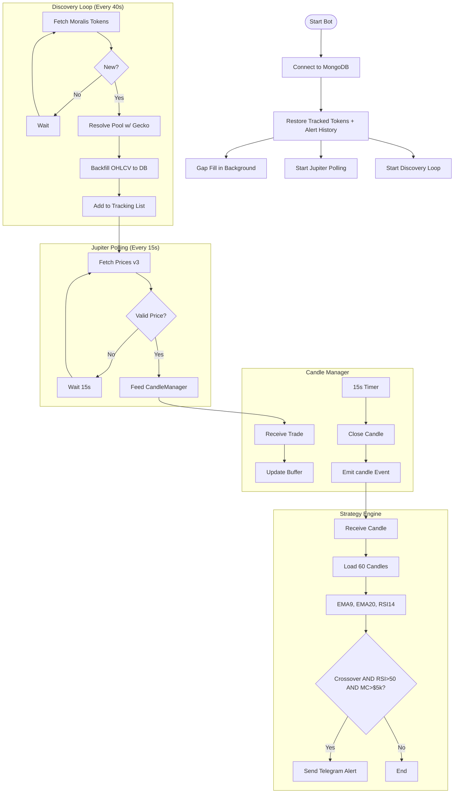

# Token Tracker V0.2 — Walkthrough

## Architecture



## Files

| File | Purpose |
|---|---|
| `index.js` | Main runner — discovery, event wiring, alert logic |
| `services/moralis.js` | Graduated token discovery (multi-launchpad, parallel) |
| `services/gecko.js` | GeckoTerminal pool resolution & OHLCV backfill |
| `services/jupiter.js` | Jupiter Price API v3 polling (15s) |
| `services/candleManager.js` | 15s OHLCV aggregation (EventEmitter) |
| `services/strategy.js` | EMA 9/20 crossover + RSI 14 > 50 |
| `services/storage.js` | MongoDB save/query helpers + `getLatestCandleTime` |
| `services/backfillQueue.js` | Retry queue + `gapFillOnStartup` |
| `models/Token.js` | Token schema: `launchedAt`, `lastAlertMarketCap`, `lastAlertSentAt` |
| `models/Candle.js` | 15s OHLCV candle schema |
| `config/db.js` | Mongoose connection |

## Setup

```env
MORALIS_API_KEY=...
JUPITER_API_KEY=...
TELEGRAM_BOT_TOKEN=...
TELEGRAM_CHAT_ID=...
MONGODB_URI=mongodb://localhost:27017/token_tracker_v2
```

```bash
node index.js
```

## Live Data Pipeline

1. **Discovery** (every 40s): Moralis returns latest pump.fun tokens graduated to Raydium. Multi-launchpad ready — add slugs to `EXCHANGES` in `moralis.js`.
2. **Backfill**: GeckoTerminal returns up to 300 1-min candles per pool, saved to MongoDB with duplicate-safe `insertMany`.
3. **Gap Fill** (on restart): `gapFillOnStartup()` checks each tracked token's latest candle timestamp. Gaps > 1 min trigger a GeckoTerminal re-fetch. Runs in the background — does not delay Jupiter startup.
4. **Jupiter Price API**: Polls `https://api.jup.ag/price/v3` every 15s. Batches of 100 tokens. Authenticated via `x-api-key` header. Volume is always 0 (not provided by v3).
5. **CandleManager**: 15s aligned clock collapses buffered price ticks into OHLCV candles and emits them.
6. **Strategy**: 60 most recent candles loaded. Signal fires on EMA 9 crossing above EMA 20 with RSI > 50.
7. **MC Filter**: Signals with market cap < $5,000 are suppressed.
8. **Alert**: Telegram message sent with market cap, token age, MC delta (vs previous alert), and clickable links.

## Alert Format

```
🚨 EMA RSI Alert
──────────────────
📌 Ticker: MILLI
⏱ Age: 2h 14m
💰 Mkt Cap: $23.8K
📈 MC Δ: +18.1% since last alert (12m ago)
📈 RSI: 62.45
📐 EMA 9:  2.3812e-5
📐 EMA 20: 2.1044e-5
🔗 Jupiter · Axiom · DexScreener
`<mint>`
```

- **Age**: From `launchedAt` (Moralis graduation time). Falls back to `addedAt` for pre-existing tokens.
- **MC Δ**: From `lastAlertMarketCap` in Token doc — survives bot restarts.
- **Axiom link**: Uses pool address (required). Omitted if pool not yet resolved.

## Rate Limit Summary

| Service | Limit | Our Usage |
|---|---|---|
| Jupiter v3 | ~20 req/min (free) | 4–20 req/min depending on token count |
| GeckoTerminal | ~30 req/min | Max 24 req/min (2.5s throttle) |
| Moralis | Plan-dependent | 1–2 req per 40s |

Safe token ceiling: ~450 tokens before Jupiter free tier is saturated.

## Bug Fixes Applied (Session)

- `moralis.js`: Missing `getLastUpdate` export → `/api` Moralis status was always 🔴
- `backfillQueue.js`: `_trackToken` was never called after backfill (called after `addToken` made `tracked.has()` return true)
- `jupiter.js`: Debug logs left permanently active (logged API key + full URL every 15s)
- Stale `Helius`/`v2` references in doc comments across 4 files
